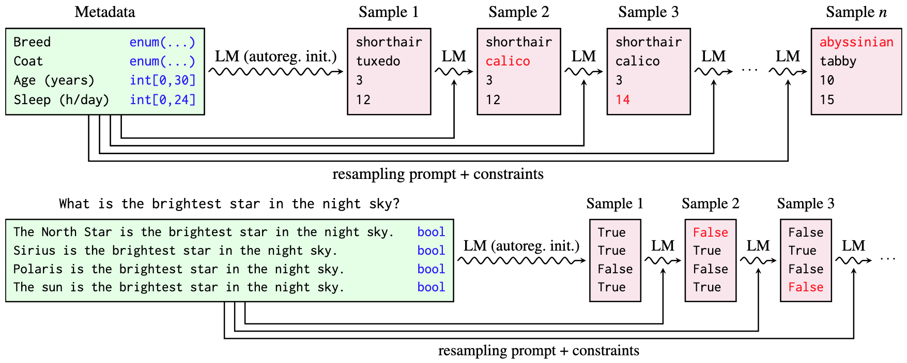

# Structured Inference with Large Language Gibbs
This repository contains the code for the paper "Structured Inference with Large Language Gibbs" (Under review, ICML 2026 SPIGM Workshop, paper will be available soon).

<p align="center"></p>

---
> **Abstract:**  The knowledge encoded in large language models (LLMs) can serve as a substrate for structured reasoning over variables describing a complex world, but accessing this knowledge in a probabilistically coherent manner poses a difficult inference problem. We propose Large Language Gibbs, a scheme for structured probabilistic inference that uses conditional distributions of an LLM as transition operators. Rather than sampling structured objects through single-pass autoregressive generation, we iteratively resample individual variables conditioned on others using an LLM's next-token conditionals. This approach avoids order-dependent biases and produces a stationary distribution that reflects a compromise between all local conditionals. We apply this approach to sampling from synthetic distributions, consistent reasoning tasks, and Bayesian structure learning. The results suggest that the use of LLM conditionals in MCMC is a practical alternative to one-pass generation for structured probabilistic inference under a world prior accessible through noisy LLM conditionals.


## Installation

We recommend using [uv](https://docs.astral.sh/uv/) to install dependencies and run the project.

First, run the following command to install the dependencies (this will automatically create `.venv` in the root directory):

```bash
uv sync
```

## Experiments
We have three sets of experiments:

1. Sampling from simple distributions (§4)
2. Consistent reasoning (§5.1)
3. Bayesian structure learning (§5.2)

See README.md in each subdirectory for more details.
